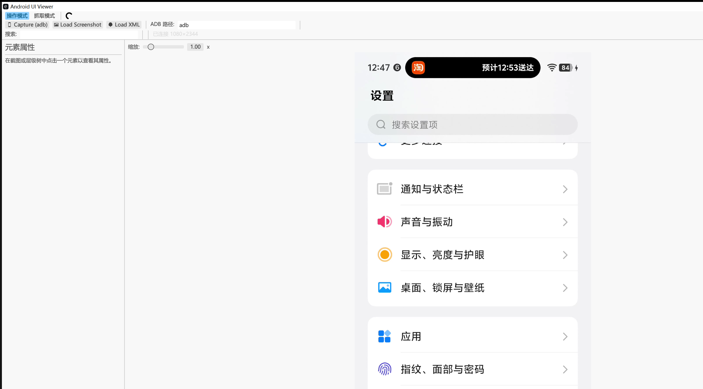

# Android UI Viewer

基于 Rust + [eframe/egui](https://github.com/emilk/egui) 的 Android 界面层级查看器（类似 `uiautomatorviewer`）。通过 adb 抓取设备当前界面的截图与 UI 层级（XML），直观地查看控件树、控件边界与属性。

## 界面预览



## 功能

- **一键抓取**：通过 adb 执行 `screencap` 和 `uiautomator dump`，同时获取截图与界面层级。
- **本地导入**：支持将截图（png/jpg/jpeg）和 uiautomator XML 拖入窗口或通过文件对话框加载。
- **三栏布局**：
  - 左侧：元素属性（class、resource-id、text、bounds 等，全部显示无需滚动）。
  - 中间：截图，可缩放（0.25x~5x）、拖拽平移，并叠加控件边界高亮。
  - 右侧：UI 层级结构树（默认较宽，支持横向/纵向滚动）。
- **双向联动高亮**：
  - 点击截图任意位置，自动选中最内层控件并定位到层级树对应节点。
  - 点击/悬停层级树中的节点，截图上的对应控件同步高亮。
- **搜索过滤**：按任意属性关键字过滤节点；选中节点时自动展开其祖先链。
- **坐标信息**：顶栏实时显示鼠标在截图上的像素坐标，以及当前选中控件的边界与尺寸。
- **中文字体**：自动加载系统 CJK 字体，保证属性中文正常显示。

## 操作模式（scrcpy 实时控制）

除了静态抓取，本工具还内置了「操作模式」：通过 scrcpy 在设备端拉起视频流，本地用 FFmpeg（scrcpy 自带的 `avcodec`/`avutil` DLL）解码 H.264 并显示实时画面，同时**经由 scrcpy 控制通道**把触摸/按键实时下发到设备。

- 在顶栏切换到「操作模式」即开始会话（首次需设置 scrcpy 目录，例如 `D:\scrcpy-win64-v4.0`，需包含 `scrcpy-server` 与 `avcodec-62.dll`/`avutil-60.dll`）。
- 直接在画面上**点击 = 轻触、按住拖动 = 滑动、长按 = 长按**，右键 = 返回；这些都走 scrcpy 控制通道，延迟远低于 `adb shell input`。
- **实体键盘透传**：鼠标悬停在手机画面上时，物理键盘直接输入到设备——字母/数字/标点走文本通道（保留大小写与中文输入法），方向键/回车/删除/Home/End/翻页/F1–F12 等走按键通道；Ctrl/Cmd+字母（如 Ctrl+C）作为组合键下发（含 Shift/Alt/Ctrl/Meta 修饰符）。
- **双指操作**：在画面上按住**右键并拖动**即模拟第二根手指，可双指捏合缩放；单纯右键点击仍作为「返回」。
- **鼠标滚轮滚动**：鼠标悬停在手机画面上时，滚轮直接转为设备的 `AMOTION_EVENT_AXIS_VSCROLL/HSCROLL`（走 scrcpy 独立的 inject_scroll 消息，21 字节协议）；向下滚 = 内容上滚，符合直觉。
- 顶栏按钮：返回 / 主页 / 最近 / 电源 / 音量±，以及文本输入框与「抓取层级」（抓取当前界面 XML 叠加到画面上，可点选元素）。
- 触摸坐标以**视频帧分辨率**为基准、由设备端按当前分辨率缩放，因此设置「最大尺寸」也不会错位。
- 若控制通道建立失败（如旧版 server），会自动回退到 `adb shell input`，状态栏会提示。

## 环境要求

- Rust 工具链（`cargo`）
- adb 且已接入一台 Android 设备（仅使用「Capture」功能时需要；浏览本地文件不需要）
- **操作模式（实时控制）需要 scrcpy**：PC 端需有 scrcpy v4.0 的 Windows 包（含 `scrcpy-server` 与 `avcodec-62.dll` / `avutil-60.dll`）。
  - 优先使用界面里填写的「scrcpy 目录」，或环境变量 `SCRCPY_SERVER_PATH`，或用 `where scrcpy` 自动探测本机已安装的 scrcpy。
  - **若都找不到，工具会在首次启动时自动从官方下载 `scrcpy-win64-v4.0.zip`，只抽取所需文件到可执行文件旁的 `scrcpy-bundle/` 缓存目录（仅下载一次，之后复用）。**
  - 也可手动下载：<https://github.com/Genymobile/scrcpy/releases>（取 `scrcpy-win64-v4.0.zip` 解压即可）。

## 构建与运行

```bash
cargo run           # 调试运行
cargo build --release && ./target/release/android-ui-viewer.exe
```

## 验证 / 测试

实时操作模式（scrcpy 控制通道）有两层验证：

- **真机端到端冒烟测试**（需要一台已 `adb` 授权连接的设备）：
  ```bash
  cargo run --example smoke
  ```
  它会拉起真实的 `live::start` 会话，确认「视频 + 控制双连接」建立，
  并注入 点按 + BACK + 文本，再确认视频帧仍在持续到达。全部通过则输出
  `RESULT: PASS`。

- **离线协议测试**（无需设备，CI 友好）：
  ```bash
  cargo run --example control_protocol_test
  ```
  用一个模拟的 scrcpy 控制服务器接收真实 `LiveControl` 发出的字节，
  逐字段断言触摸(32B)/按键(14B)/文本(len+utf8)/滚动(21B) 完全符合 scrcpy v4.0 线格式。
  输出 `RESULT: PASS` 即代表序列化与官方协议字节级一致。

## 使用说明

1. 连接设备并确认 `adb devices` 能识别到设备。
2. 点击顶栏 **`📱 Capture (adb)`** 抓取当前屏幕。
3. 或直接把 `.png` / `.xml` 文件拖入窗口。
4. 在截图或层级树中点击元素，即可查看属性并高亮对应控件。

## 项目结构

```
src/
├── main.rs      # 程序入口与窗口配置
├── lib.rs       # 模块声明（app / adb / ui_tree / live / scrcpy）
├── app.rs       # GUI 布局、树渲染、属性展示、截图覆盖层、操作模式交互
├── adb.rs       # adb 截图与 uiautomator dump 封装
├── ui_tree.rs   # UI 层级 XML 解析、命中检测、节点查询
├── live.rs      # scrcpy 实时会话：推送 server、拉流、控制通道、自动下载 scrcpy 包
└── scrcpy.rs    # 动态加载 FFmpeg DLL 软解 H.264 → RGBA
```